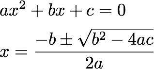

## Builder Coding Exercise
You are asked to implement the Builder design pattern for rendering simple chunks of code.

Sample use of the builder you are asked to create:

auto cb = CodeBuilder{"Person"}.add_field("name", "string").add_field("age", "int");
cout << cb;
The expected output of the above code is:

class Person
{
  string name;
  int age;
};
Please observe the same placement of curly braces and use two-space indentation.

#include <string>
#include <ostream>
using namespace std;

class CodeBuilder
{
public:
  CodeBuilder(const string& class_name)
  {
      // todo
  }

  CodeBuilder& add_field(const string& name, const string& type)
  {
    // todo
  }

  friend ostream& operator<<(ostream& os, const CodeBuilder& obj)
  {
    // todo
  }
};

## Factory Coding Exercise
You are given a class called Person . The person has two fields: id , and name .

Please implement a non-static PersonFactory that has a create_person()  method that takes a person's name.

The id  of the person should be set as a 0-based index of the object created. So, the first person the factory makes should have id=0, second id=1 and so on.

#include <string>
using namespace std;

struct Person
{
  int id;
  string name;
};

class PersonFactory
{
public:
  Person create_person(const string& name)
  {
    // todo
  }
};

## Singleton Coding Exercise
Implementing a singleton is a bit too easy, so you've got a different challenge. 

You are given the function SingletonTester::is_singleton()  defined below. This function takes a factory, and needs to return true  or false  depending on whether that factory produces singletons.

This one's actually easy. Ask yourself: what traits do two 'instances' of a singleton have in common?

#include <functional>
using namespace std;

struct SingletonTester
{
  template <typename T>
  bool is_singleton(function<T*()> factory)
  {
    // TODO
  }
};

## Adapter Coding Exercise
Here's a very synthetic example for you to try.

You are given a Rectangle  protocol and an extension method on it. Try to define a SquareToRectangleAdapter  that adapts the Square  to the Rectangle  interface.

struct Square
{
  int side{ 0 };

  explicit Square(const int side)
    : side(side)
  {
  }
};

struct Rectangle
{
  virtual int width() const = 0;
  virtual int height() const = 0;

  int area() const
  {
    return width() * height();
  }
};

struct SquareToRectangleAdapter : Rectangle
{
  SquareToRectangleAdapter(const Square& square)
  {
      // todo
  }
  // todo
};

## Bridge Coding Exercise
You are given an example of an inheritance hierarchy which results in Cartesian-product duplication.

Please refactor this hierarchy, giving the base class Shape  an initializer that takes a Renderer  defined as

struct Renderer
{
  virtual string what_to_render_as() const = 0;
}
as well as VectorRenderer and RasterRenderer.

The expectation is that each constructed object has a member called str()  that returns its textual representation, for example,

Triangle(RasterRenderer()).str() // returns "Drawing Triangle as pixels" 

#include <string>
using namespace std;

struct Shape
{
    string name;
}

struct Triangle : Shape
{
    Triangle()
    {
        name = "Circle";
    }
}

struct Square : Shape
{
    Square()
    {
        name = "Square";
    }
}

struct VectorSquare : Square
{
    string str() const
    {
        return "Drawing " + name + " as lines";
    }
}

struct RasterSquare : Square
{
    string str() const
    {
        return "Drawing " + name + " as pixels";
    }
}

// imagine e.g. VectorTriangle/RasterTriangle etc. here

## Composite Coding Exercise
Consider the code presented below. The sum()  function takes a vector of pointers to either SingleValue or ManyValues instances and adds up all their elements together.

Please complete the implementation so that the sum()  function starts to operate correctly. This may involve giving the classes a common interface, among other things.

Here is an example of how the function might be used:

SingleValue single_value{ 1 };
ManyValues other_values;
other_values.add(2);
other_values.add(3);
sum({ &single_value, &other_values }); // returns 6

#include "exercise.h"

int sum(const vector<ContainsIntegers*> items)
{
    // TODO
}

.h
#include <iostream>
#include <string>
#include <vector>
using namespace std;

struct SingleValue
{
  int value{ 0 };

  SingleValue() = default;

  explicit SingleValue(const int value)
    : value{value}
  {
  }
  
  // TODO
};

struct ManyValues : vector<int>
{
  void add(const int value)
  {
    push_back(value);
  }
};

int sum(const vector<ContainsIntegers*> items);

## Decorator Coding Exercise
Roses can be red, blue or red and blue. Given the class interface Flower and class Rose, build decorators RedFlower and BlueFlower that would print the following:

Rose rose;
RedFlower red_rose{rose};
RedFlower red_red_rose{red_rose};
BlueFlower blue_red_rose{red_rose};
cout << rose.str();          // "A rose"
cout << red_rose.str();      // "A rose that is red"
cout << red_red_rose.str();  // "A rose that is red"
cout << blue_red_rose.str(); // "A rose that is red and blue"

#include <string>
using namespace std;

struct Flower
{
  virtual string str() = 0;
};

struct Rose : Flower
{
  string str() override {
    // todo
  }
};

struct RedFlower : Flower
{
};

struct BlueFlower : Flower
{
};

## Proxy Coding Exercise
You are given the Person  class and asked to write a ResponsiblePerson  wrapper/proxy that does the following:

Allows person to drink unless they are younger than 18 (in that case, return "too young")

Allows person to drive unless they are younger than 16 (otherwise, "too young")

In case of driving while drink, returns "dead"

The interface of ResponsiblePerson  has to match that of Person , except for the constructor, which takes an underlying Person object..

class Person
{
  friend class ResponsiblePerson;
  int age;
public:
  Person(int age) : age(age) {}

  int get_age() const { return age; }
  void set_age(int age) { this->age=age; }

  string drink() const { return "drinking"; }
  string drive() const { return "driving"; }
  string drink_and_drive() const { return "driving while drunk"; }
};

class ResponsiblePerson
{
    ResponsiblePerson(const Person &person) : person(person) {}
    // todo
private:
    Person person;
};

## Proxy Coding Exercise
You are given the Person  class and asked to write a ResponsiblePerson  wrapper/proxy that does the following:

Allows person to drink unless they are younger than 18 (in that case, return "too young")

Allows person to drive unless they are younger than 16 (otherwise, "too young")

In case of driving while drink, returns "dead"

The interface of ResponsiblePerson  has to match that of Person , except for the constructor, which takes an underlying Person object..

struct Creature;
struct Game
{
  vector<Creature*> creatures;
};

struct StatQuery
{
  enum Statistic { attack, defense } statistic;
  int result;
};

struct Creature
{
protected:
  Game& game;
  int base_attack, base_defense;

public:
  Creature(Game &game, int base_attack, int base_defense) : game(game), base_attack(base_attack),
                                                            base_defense(base_defense) {}
  virtual int get_attack() = 0;
  virtual int get_defense() = 0;
};

class Goblin : public Creature
{
public:
  Goblin(Game &game, int base_attack, int base_defense) : Creature(game, base_attack, base_defense) {}

  Goblin(Game &game) : Creature(game, 1, 1) {}

  int get_attack() override {
    // todo
  }

  int get_defense() override {
    // todo
  }
};

class GoblinKing : public Goblin
{
public:
  GoblinKing(Game &game) : Goblin(game, 3, 3) {}

  // todo
};

## Command Coding Exercise
Implement the Account::process()  function to process different account commands. The rules are obvious:

success  indicates whether the operation was successful
You can only withdraw money if you have enough in your account

struct Command
{
  enum Action { deposit, withdraw } action;
  int amount{0};
  bool success{false};
};

struct Account
{
  int balance{0};

  void process(Command& cmd)
  {
    // todo
  }
};

## Interpreter Coding Exercise
You are asked to write an expression processor for simple numeric expressions with the following constraints:

Expressions use integral values (e.g., "13" ), single-letter variables defined in variables , as well as + and - operators only
There is no need to support braces or any other operations
If a variable is not found in Variables  (or if we encounter a variable with >1 letter, e.g. ab), the evaluator returns 0 (zero)
In case of any parsing failure, evaluator returns 0
Example:

calculate("1+2+3")  should return 6
calculate("1+2+xy")  should return 0
calculate("10-2-x")  when x=3 is in variables should return 5

struct ExpressionProcessor
{
  map<char,int> variables;

  int calculate(const string& expression)
  {
    // TODO
  }
};

## Iterator Coding Exercise
Given the following definition of a Node<T>, please implement preorder traversal that returns a sequence of Ts. I have greatly simplified the problem by adding an accumulator argument into the preorder_traversal()  function.

#include <iostream>
#include <vector>
using namespace std;

template <typename T>
struct Node
{
    T value;
    Node *left{nullptr}, *right{nullptr}, *parent{nullptr};

    Node(T value) : value(value) {}

    Node(T value, Node<T> *left, Node<T> *right) : value(value), left(left), right(right) {
      left->parent = right->parent = this;
    }

    // traverse the node and its children preorder
    // and put all the results into `result`
    void preorder_traversal(vector<Node<T>*>& result)
    {
        // todo
    }
};

## Mediator Coding Exercise
Our system has any number of instances of Participant  classes. Each Participant has a value  integer, initially zero.

A participant can say()  a particular value, which is broadcast to all other participants. At this point in time, every other participant is obliged to increase their value  by the value being broadcast.

Example:

Two participants start with values 0 and 0 respectively
Participant 1 broadcasts the value 3. We now have Participant 1 value = 0, Participant 2 value = 3
Participant 2 broadcasts the value 2. We now have Participant 1 value = 2, Participant 2 value = 3

struct Participant : IParticipant
{
    int value{0};
    Mediator& mediator;

    Participant(Mediator &mediator) : mediator(mediator)
    {
      mediator.participants.push_back(this);
    }

    void say(int value)
    {
        // todo
    }
};

/*
## Observer Coding Exercise
Imagine a game where one or more rats can attack a player. Each individual rat has an attack  value of 1. However, rats attack as a swarm, so each rat's attack  value is equal to the total number of rats in play.

Given that a rat enters play through the constructor and leaves play (dies) via its destructor, please implement the Game  and Rat  classes so that, at any point in the game, the attack  value of a rat is always consistent.
*/

#include <iostream>
#include <vector>
using namespace std;

struct Game
{
    // todo
};

struct Rat : IRat
{
    Game& game;
    int attack{1};

    Rat(Game &game) : game(game)
    {
      // todo, obviously
    }

    ~Rat() 
    { 
        // rat dies here!
    }
};

## State Coding Exercise
A combination lock is a lock that opens after the right digits have been entered. A lock is preprogrammed with a combination (e.g., 12345 ) and the user is expected to enter this combination to unlock the lock.

The lock has a status  field that indicates the state of the lock. The rules are:

If the lock has just been locked (or at startup), the status is LOCKED.
If a digit has been entered, that digit is shown on the screen. As the user enters more digits, they are added to Status.
If the user has entered the correct sequence of digits, the lock status changes to OPEN.
If the user enters an incorrect sequence of digits, the lock status changes to ERROR.
Please implement the CombinationLock  class to enable this behavior. Be sure to test both correct and incorrect inputs.

Here is an example unit test for the lock:

CombinationLock cl({1,2,3});
ASSERT_EQ("LOCKED", cl.status);
cl.enter_digit(1);
ASSERT_EQ("1", cl.status);
cl.enter_digit(2);
ASSERT_EQ("12", cl.status);
cl.enter_digit(3);
ASSERT_EQ("OPEN", cl.status);

#include <iostream>
#include <vector>
#include <string>
using namespace std;

class CombinationLock
{
    vector<int> combination;
public:
    string status;

    CombinationLock(const vector<int> &combination) : combination(combination) {
      
    }

    void enter_digit(int digit)
    {
      // TODO
    }
};

## Strategy Coding Exercise
Consider the quadratic equation and its canonical solution:

The part b^2-4*a*c is called the discriminant. Suppose we want to provide an API with two different strategies for calculating the discriminant:

In OrdinaryDiscriminantStrategy , If the discriminant is negative, we return it as-is. This is OK, since our main API returns std::complex  numbers anyway.
In RealDiscriminantStrategy , if the discriminant is negative, the return value is NaN (not a number). NaN propagates throughout the calculation, so the equation solver gives two NaN values.
Please implement both of these strategies as well as the equation solver itself. With regards to plus-minus in the formula, please return the + result as the first element and - as the second.

## Template Method Coding Exercise
Imagine a typical collectible card game which has cards representing creatures. Each creature has two values: Attack and Health. Creatures can fight each other, dealing their Attack damage, thereby reducing their opponent's health.

The class CardGame implements the logic for two creatures fighting one another. However, the exact mechanics of how damage is dealt is different:

TemporaryCardDamage : In some games (e.g., Magic: the Gathering), unless the creature has been killed, its health returns to the original value at the end of combat.
PermanentCardDamage : In other games (e.g., Hearthstone), health damage persists.
You are asked to implement classes TemporaryCardDamageGame  and PermanentCardDamageGame  that would allow us to simulate combat between creatures.

Some examples:

With temporary damage, creatures 1/2 and 1/3 can never kill one another. With permanent damage, second creature will win after 2 rounds of combat.
With either temporary or permanent damage, two 2/2 creatures kill one another.

#include <iostream>
#include <vector>
#include <complex>
#include <tuple>
using namespace std;

struct Creature
{
    int attack, health;

    Creature(int attack, int health) : attack(attack), health(health) {}
};

struct CardGame
{
    vector<Creature> creatures;

    CardGame(const vector<Creature> &creatures) : creatures(creatures) {}

    // return the index of the creature that won (is a live)
    // example:
    // - creature1 alive, creature2 dead, return creature1
    // - creature1 dead, creature2 alive, return creature2
    // - no clear winner: return -1
    int combat(int creature1, int creature2)
    {
      // todo
    }

    virtual void hit(Creature& attacker, Creature& other) = 0;
};

struct TemporaryCardDamageGame : CardGame
{
    TemporaryCardDamageGame(const vector<Creature> &creatures) : CardGame(creatures) {}

    void hit(Creature &attacker, Creature &other) override {
      // todo
    }
};

struct PermanentCardDamageGame : CardGame
{
    PermanentCardDamageGame(const vector<Creature> &creatures) : CardGame(creatures) {}

    void hit(Creature &attacker, Creature &other) override
    {
      // todo
    }
};

## Visitor Coding Exercise
You are asked to implement a double-dispatch visitor called ExpressionPrinter  for printing different mathematical expressions. The range of expressions covers addition and multiplication - please put round brackets around addition but not around multiplication! Also, please avoid any blank spaces in output.

Example:

Input: AdditionExpression{Literal{2}, Literal{3}}  -- btw, this is pseudocode, you cannot inline those references unfortunately
Output: (2+3) 
Here is the corresponding unit test:

Value v2{2};
Value v3{3};
AdditionExpression simple{v2,v3};
ExpressionPrinter ep;
ep.accept(simple);
ASSERT_EQ("(2+3)", ep.str());

#include <string>
#include <sstream>
using namespace std;

struct ExpressionVisitor
{
  // accept methods here :)
};

struct Expression
{
  virtual void visit(ExpressionVisitor& ev) = 0;
};

struct Value : Expression
{
  int value;

  Value(int value) : value(value) {}
};

struct AdditionExpression : Expression
{
  Expression &lhs, &rhs;

  AdditionExpression(Expression &lhs, Expression &rhs) : lhs(lhs), rhs(rhs) {}
};

struct MultiplicationExpression : Expression
{
  Expression &lhs, &rhs;

  MultiplicationExpression(Expression &lhs, Expression &rhs)
    : lhs(lhs), rhs(rhs) {}
};

struct ExpressionPrinter : ExpressionVisitor
{
    // accept methods here :)

  string str() const { /* todo */ }
};

## Flyweight Coding Exercise
You are given a class called Sentence , which takes a string such as "hello world". You need to provide an interface such that the indexer (operator [] ) returns a WordToken  that can be used to capitalize a particular word in the sentence.

Typical use would be something like:

Sentence sentence("hello world");
sentence[1].capitalize = true;
cout << sentence.str(); // prints "hello WORLD"

struct Sentence
{
  struct WordToken
  {
    bool capitalize;
  };

  Sentence(const string& text)
  {
    // todo
  }

  WordToken& operator
  {
    // todo
  }

  string str() const
  {
    // todo
  }
};

## Memento Coding Exercise
A TokenMachine  is in charge of keeping tokens. Each Token  is a reference type with a single numerical value. The machine supports adding tokens and, when it does, it returns a memento representing the state of that system at that given time.

You are asked to fill in the gaps and implement the Memento design pattern for this scenario. Pay close attention to the situation where a token is fed in as a smart pointer and its value is subsequently changed on that pointer - you still need to return the correct system snapshot!

#include <iostream>
#include <vector>
#include <memory>
using namespace std;

struct Token
{
  int value;

  Token(int value) : value(value) {}
};

struct Memento
{
  vector<shared_ptr<Token>> tokens;
};

struct TokenMachine
{
  vector<shared_ptr<Token>> tokens;

  Memento add_token(int value)
  {
    return add_token(make_shared<Token>(value));
  }

  // adds the token to the set of tokens and returns the
  // snapshot of the entire system
  Memento add_token(const shared_ptr<Token>& token)
  {
    // todo
  }

  // reverts the system to a state represented by the token
  void revert(const Memento& m)
  {
      // todo
  }
};

